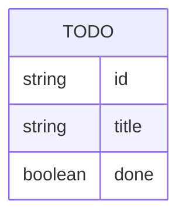

# Domain Model

The domain is a single entity: a Todo item held in the API's in-memory store.

A Todo has a server-generated `id`, a required non-blank `title`, and a `done`
flag that starts `false` and is flipped by the toggle action. There is no
relationship to model — the whole domain is this one entity, held in a single
shared, unordered-by-contract list.